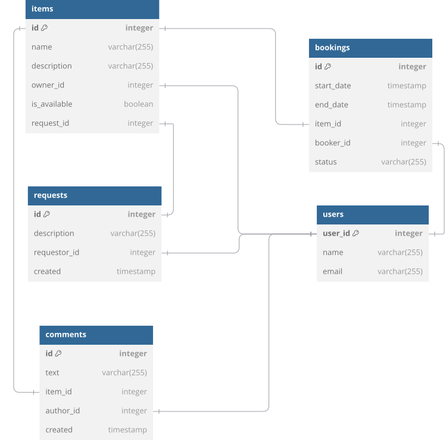

# Shareit project

Представьте, что на воскресной ярмарке вы купили несколько картин и хотите повесить их дома. Но вот незадача — для этого нужна дрель, а её у вас нет.

Можно, конечно, пойти в магазин и купить, но в такой покупке мало смысла — после того, как вы повесите картины, дрель будет просто пылиться в шкафу. Можно пригласить мастера — но за его услуги тоже нужно заплатить. 

И тут вы вспоминаете, что видели дрель у друга. Сама собой напрашивается идея — одолжить её. Большая удача, что у вас оказался друг с дрелью и вы сразу вспомнили про него! Иначе в поисках инструмента пришлось бы писать всем друзьям и знакомым. Или вернуться к первым двум вариантам — покупке дрели или найму мастера.

Насколько было бы удобнее, если бы под рукой был сервис, с помощью которого пользователи делятся вещами!

Shareit и есть именно такой проект. 

## Стек технологий

* Java 21, Spring Boot, Lombok, Hibernate, PostgreSQL, H2Database, REST API, Maven, JUnit

## Архитектура

Сервис состоит из двух модулей:

* ### gateway
* ### server

## Описание API

### User

| HTTP request                           | Method      | Description                   |
|----------------------------------------|-------------|-------------------------------|
| **POST** /users                        | **save**    | Добавление пользователя       |
| **PATCH** /users/{userId}              | **update**  | Обновить данные пользователя  |
| **GET** /users/{userId}                | **getById** | Получить данные пользователя  |
| **GET** /users?from={from}&size={size} | **getAll**  | Получить список пользователей |
| **DELETE** /users/{userId}             | **delete**  | Удалить пользователя          |

### Item

| HTTP request                           | Method                | Description                    |
|----------------------------------------|-----------------------|--------------------------------|
| **POST** /items                        | **save**              | Добавление вещи                |
| **PATCH** /items/{itemId}              | **update**            | Обновить данные вещи           |
| **GET** /items/{itemId}                | **getById**           | Получить информацию о вещи     |
| **DELETE** /items/{itemId}             | **delete**            | Удаление вещи                  |
| **GET** /items?from={from}&size={size} | **getItemsByOwnerId** | Получить список вещей          |
| **GET** /items?from={from}&size={size} | **search**            | ППоиск вещи по значению "text" |
| **POST** /items/{itemId}/comment       | **saveComment**       | Добавление комментария к вещи  |

### Booking

| HTTP request                                                  | Method               | Description                                            |
|---------------------------------------------------------------|----------------------|--------------------------------------------------------|
| **POST** /bookings                                            | **saveRequest**      | Добавить бронь вещи                                    |
| **PATCH** /bookings/{bookingId}?approved={approved}           | **approved**         | Подтвердить/отклонить бронь                            |
| **GET** /bookings/{bookingId}                                 | **findById**         | Получить информацию о брони, созданной пользователем   |
| **GET** /bookings?state={state}&from={from}&size={size}       | **findAllByUserId**  | Получить список вещей забронированных пользователем    |
| **GET** /bookings/owner?state={state}&from={from}&size={size} | **findAllByOwnerId** | Получить список забронированных вещей для их владельца |

### Request

| HTTP request                                                  | Method              | Description                                        |
|---------------------------------------------------------------|---------------------|----------------------------------------------------|
| **POST** /requests                                            | **saveItemRequest** | Добавить запрос на добавление вещи                 |
| **GET** /requests/owner?state={state}&from={from}&size={size} | **getAllByUser**    | Получить список всех запросов других пользователей |
| **GET** /requests/all?from={from}&size={size}                 | **getAll**          | Получить список всех запросов пользователя         |
| **GET** /requests/{requestId}                                 | **getById**         | Получение информации о запросе                     |

## ER диаграмма

## Дамп БД
- [schema.sql](src/main/resources/schema.sql)
- [data.sql](src/main/resources/data.sql)